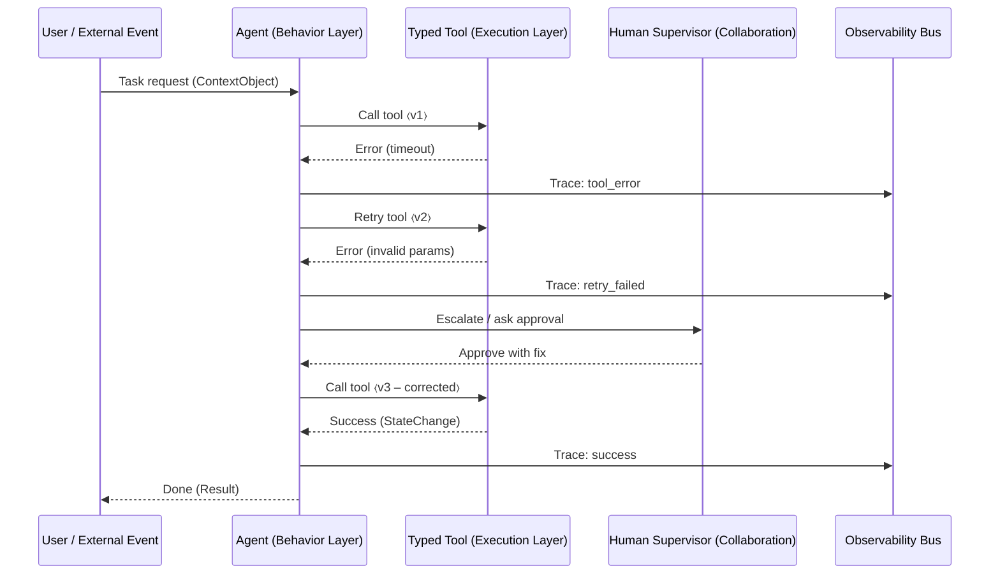

Execution Flow: Retry → Escalate → Resume

Legend

ContextObject → structured, typed input from Context Layer

Tool 〈v⟩ → versioned, contract‑driven API

Trace events flow into Observability for replay & metrics

This diagram demonstrates explicit control flow, structured retries, human‑in‑the‑loop escalation, and full observability — core tenets of CAA.
