# 🏗️ The Cognitive Agentic Architecture (CAA) Stack

CAA is a blueprint for production‑grade agentic systems. Each layer owns a single concern, with typed interfaces between them. The result: systems that are modular, observable, and reliable.

```mermaid
graph TD
    %% === Core Thought Cycle ===
    subgraph "Thought Cycle"
      direction LR
      START([External Event / User Input]) --> C[Context Layer]
      C -- ContextObject --> B[Behavior Layer]
      B -- ExecutionPlan --> E[Execution Layer]
      E -- StateChange --> S[State Layer]
      S -- StateSnapshot --> C
    end

    %% === Collaboration Hooks ===
    subgraph "Collaboration"
      direction TB
      S -. StateSnapshot .-> COL[Collaboration Layer]
      E -. Execution Events .-> COL
      COL -. Human Feedback .-> B
      COL -. Human Override .-> E
    end

    %% === Observability Bus ===
    subgraph "Telemetry Bus"
      direction TB
      C -- trace --> O((Observability))
      B -- trace --> O
      E -- trace --> O
      S -- trace --> O
      COL -- trace --> O
    end
```

**Data Flow (Left ➜ Right):**

1. **Context Layer** – Normalizes raw input → `ContextObject` (typed).
2. **Behavior Layer** – Plans next step(s) → `ExecutionPlan`.
3. **Execution Layer** – Executes plan, calls tools → `StateChange`.
4. **State Layer** – Persists & versions state → `StateSnapshot`.
5. **Cycle** repeats until goal met or human intervenes.

*Collaboration* hooks run in parallel, while **Observability** taps every edge to provide full traces for replay & evaluation.

---

## Layer Cheat‑Sheet

| # | Layer         | Owns                             | Key Artifact    |
| - | ------------- | -------------------------------- | --------------- |
| 1 | Context       | Input preprocessing & enrichment | `ContextObject` |
| 2 | Behavior      | Planning & routing               | `ExecutionPlan` |
| 3 | Execution     | Deterministic action             | `StateChange`   |
| 4 | State         | Persistent memory & checkpoints  | `StateSnapshot` |
| 5 | Collaboration | Human interaction & approvals    | UX events       |
| ↺ | Observability | Tracing & metrics                | `TraceEvent`    |

> **Separation of Concerns** gives you determinism; **Observability** gives you trust. Together they turn LLM reasoning into production‑grade execution.

## The 5-Layer Stack

CAA is composed of five sequential layers and one cross-cutting concern. A request flows through the stack, being transformed at each stage.

## Layer 1: The Context Layer

   - Role: The system's "input preprocessor." It normalizes, validates, and semantically enriches all incoming data from users or other systems.

   - Input: Raw user query, system events.

   - Output: A structured, typed ContextObject.

   - Principles Embodied: Context is Typed & Structured.

## Layer 2: The Behavior Layer

   - Role: The "agent's brain." It takes the clean context and determines the high-level plan or next action.

   - Input: ContextObject.

   - Output: An ExecutionPlan (a sequence of steps or a single tool call).

   - Principles Embodied: Small, Focused Agents, Prompt = Code.

## Layer 3: The Execution Layer

   - Role: The "engine room." It reliably executes the plan from the Behavior Layer.

   - Input: ExecutionPlan.

   - Output: A StateChange object, representing the result of the action.

   - Principles Embodied: Explicit Control Flow, Tools as Contracts, Composable Error Handling.

## Layer 4: The State Layer

   - Role: The "system memory." It receives state changes from the Execution Layer and persists them, maintaining the official "state of the world" for the agent.

   - Input: StateChange.

   - Output: An updated StateSnapshot (which can be fed back into the Context Layer for the next cycle).

   - Principles Embodied: State is Explicit & Persistent.

## Layer 5: The Collaboration Layer
   - Role: The "human interface." It translates system state and execution events into information for the user and accepts human input to influence the agent's behavior.

   - Input: StateSnapshot, ExecutionPlan events.

   - Output: Human-readable UI updates, requests for approval (HITL hooks).

   - Principles Embodied: Human Collaboration by Design.

--- 

## Cross-Cutting Concern: The Observability Layer

   - Role: This is not a sequential layer but a "telemetry bus." It taps into the data flow between all other layers.

   - Input: ContextObject, ExecutionPlan, StateChange, etc.

   - Output: Logs, traces, metrics for debugging and evaluation.

   - Principle Embodied: Observable Everything.

---

##     Architectural Philosophy: Why This Stack?

    "Other architectural models, like a traditional UI → Orchestration → Task stack, are excellent for deterministic software. CAA is specifically designed for the uncertainty inherent in cognitive systems. By explicitly separating Context (what is known), Behavior (what to do), and Execution (how to do it), we create a system that is more robust, easier to debug, and safer to deploy in mission-critical environments."

---

### Alternative Architectures
| CAA Layer                  | Engineering Analogy                     | Clarified Role                                                  |
| -------------------------- | --------------------------------------- | --------------------------------------------------------------- |
| Context Layer              | Input interface & preprocessor          | Normalize, validate, and semantically enrich user/system inputs |
| Execution Layer            | Core business logic runner              | Dynamically dispatch behavior, manage tool calls, retry logic   |
| State Layer                | State machine or domain state container | Tracks structured internal agent state across steps             |
| Collaboration Layer        | UX orchestration / hooks                | Human-in-the-loop, approval flows, live feedback integration    |
| Observability & Eval Layer | Telemetry, tracing, debugging, testing  | Instrumentation, logging, and eval harnesses                    |

