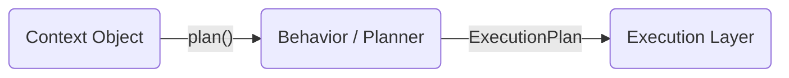

# Layer 2 – Behavior / Planner

> **Mission ‑ Decide *what* to do next, without doing it.**

The Behavior layer transforms a fully–typed **`ContextObject`** into an explicit **`ExecutionPlan`**. It is the agent’s “brain” – policy, planning, and routing – but it never touches the outside world directly.

---

## Why a separate Behavior layer?

| Pain if missing                                                                | Benefit of separation                                                          |
| ------------------------------------------------------------------------------ | ------------------------------------------------------------------------------ |
|  Execution code is littered with `if`‑trees & makes LLM calls to decide        |  Clean “think vs. do” separation enables unit‑testing of plans in milliseconds |
|  Impossible to swap planners (rule engine → LLM) without refactoring tool code |  Planner can evolve independently; execution sandbox stays stable              |
|  Hidden loops & retries emerge in prompts                                      |  Plans are first‑class, inspectable objects (`ExecutionPlan`)                  |

---

## Canonical Inputs & Outputs

| Item                    | Format               | Source / Destination |
| ----------------------- | -------------------- | -------------------- |
| **In**  `ContextObject` | Pydantic / dataclass | Layer 1 (Context)    |
| **Out** `ExecutionPlan` | Pydantic / dataclass | Layer 3 (Execution)  |



### ExecutionPlan

A minimal contract (extend as needed):

```jsonc
{
  "plan_id": "uuid",
  "steps": [
     {
       "step_id": "1",
       "tool": "lookup_customer",
       "args": {"customer_id": "X123"},
       "retry": 2,
       "on_success": "2",
       "on_failure": "fallback"
     },
     …
  ]
}
```

---

## Typical Implementations

| Approach                                        | When to use                                       |
| ----------------------------------------------- | ------------------------------------------------- |
| **Rule engine** (hard‑coded Python, JSON rules) | Deterministic flows, regulatory approval          |
| **Prompt‑based LLM planner** (single call)      | Flexible, low latency, few steps                  |
| **Recursive LLM planner** (ReAct / CoT)         | Deep tool chains, uncertain goals                 |
| **Hybrid** (rules ＋ LLM fallback)               | Best of both: guardrails first, creativity second |

All implementations emit the *same* `ExecutionPlan`, preserving the Execution layer contract.

---

## Principles Embodied

* **Small, Focused Agents** – planning is its own agent.
* **Prompt = Code** – planner prompts are versioned & testable.
* **Explicit Control Flow** – plans are data, not hidden in strings.

---

## Checklist for Production

* [ ] Unit tests for fixed plans & edge cases.
* [ ] Eval harness for LLM‑generated plans.
* [ ] Version every planner prompt or rule‑set.
* [ ] Max‑step / timeout guard to prevent infinite loops.
* [ ] Metric: *mean steps per plan* & *failure‑to‑plan rate*.

---

### When something goes wrong

* **Bad plan**?  → Behavior layer returns an `on_failure` plan that triggers fallback logic.
* **Unsupported tool**?  → Planner must validate tool names against a registry *before* emitting the plan.
* **Human override**?  → Collaboration layer can inject an alternative `ExecutionPlan` back into Execution.

---

> *“Planning and acting share the same goal – only one should touch the real world.”*
