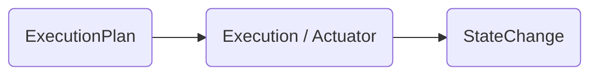

# Layer 3 – Execution / Actuator

> **Mission ‑ Turn an `ExecutionPlan` into real‑world side‑effects, safely.**

The Execution layer is the system’s "engine room." It consumes a validated **`ExecutionPlan`** from the Behavior layer and performs each step via typed tool contracts. No planning happens here – only **acting, retrying, and reporting results**.

---

## Why isolate Execution?

| Pain if merged with planning                      | Benefit of separation                   |
| ------------------------------------------------- | --------------------------------------- |
|  LLM prompts mix “think” & “do” → silent failures |  Deterministic, auditable actions       |
|  Tool wrappers littered with business rules       |  Pure adapters; easier to stub & test   |
|  Hard to add retry/back‑off without prompt hacks  |  Centralised resilience pattern library |

---

## Canonical Inputs & Outputs

| Item                    | Format               | Source / Destination |
| ----------------------- | -------------------- | -------------------- |
| **In**  `ExecutionPlan` | Pydantic / dataclass | Layer 2 (Behavior)   |
| **Out** `StateChange`   | Pydantic / dataclass | Layer 4 (State)      |



`StateChange` example:

```jsonc
{
  "plan_id": "uuid",
  "step_id": "1",
  "status": "success",
  "output": {"found": true, "customer_name": "Anna"},
  "timestamp": "2025-07-03T10:15:00Z"
}
```

---

## Key Responsibilities

### 🧩 Typed Tool Contracts

* Every tool is a **strict interface** (`InputModel` → `OutputModel`).
* Runtime validation; rejects unknown fields.
* Enables compile‑time stubs & mocks.

### 🚦 Retry / Back‑off / Circuit Breakers

* Configurable per‑step policies (`retry: 2`, `timeout: 8s`).
* Standardised exponential back‑off helpers.
* Escalate to Collaboration layer when retries exhausted.

### 🔀 Runtime Instrumentation

* Emit **`ExecutionEvent`** for every call (tool name, args hash, latency).
* Forward to Observability bus (logs, traces, metrics).

### 🛑 Interrupt & Resume

* Checks inbox for human “hold / resume” commands before executing next step.
* Persist intermediate `StateSnapshot` to allow replay / rollback.

---

## Principles Embodied

* **Tools as Contracts** – no free‑form strings, only typed adapters.
* **Explicit Control Flow** – plan drives execution, not hidden inside prompts.
* **Composable Error Handling** – retries, fallbacks, escalation paths are data‑driven.
* **Observable Everything** – each tool call is a first‑class event.

---

## Checklist for Production

* [ ] Tool registry with version tags & deprecation policy.
* [ ] Unit tests for every adapter (mock external system).
* [ ] Golden path integration test executing a full `ExecutionPlan`.
* [ ] Latency & error‑rate SLOs exported via Observability layer.
* [ ] Rollback script for side‑effects that must be reversible.

---

> *“Plans can be creative; execution must be **boringly predictable**.”*
