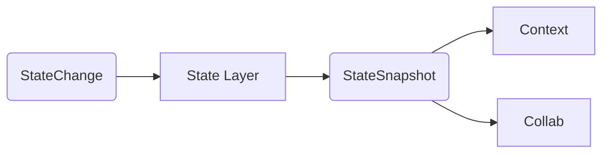

# Layer 4 – State

> **Mission ‑ Remember the world and the agent — in a way that’s testable, rewindable, and safe.**

The State layer is the agent’s persistent memory. It captures every **`StateChange`** emitted by the Execution layer and materialises a canonical **`StateSnapshot`** that the next Context cycle can trust.

---

## Why make state explicit?

| Pain if hidden in dicts / blobs           | Benefit of structured state                                       |
| ----------------------------------------- | ----------------------------------------------------------------- |
|  “Where did that variable come from?”     |  Typed schemas and versioning make provenance clear               |
|  Hard to reproduce bugs / race‑conditions |  Snapshots & checkpoints enable deterministic replay              |
|  Mixing agent belief with external truth  |  Model‑state vs. Environment‑state separation prevents corruption |
|  Memory leaks & unbounded growth          |  Lifecycle policies (TTL, compaction) keep memory sane            |

---

## Canonical Inputs & Outputs

| Item                    | Format               | Source / Destination                 |
| ----------------------- | -------------------- | ------------------------------------ |
| **In**  `StateChange`   | Pydantic / dataclass | Layer 3 (Execution)                  |
| **Out** `StateSnapshot` | Pydantic / dataclass | Layer 1 (Context) & Layer 5 (Collab) |

---

## Key Responsibilities

### 🧩 Persistent, Structured Internal State

* All fields defined via typed schemas (e.g. Pydantic models).
* Version each schema – migrations must be explicit.
* Persists to durable storage (SQL / KV / object) with ACID semantics.

### 🔄 Distinct Model vs. Environment State

* **Model‑state** = agent beliefs, intermediate variables, private notes.
* **Environment‑state** = authoritative facts from external systems.
* Clear boundary prevents an LLM hallucination from corrupting ground truth.

### ⏮️ Checkpoints, Rewinds & Diffing

* Create a **checkpoint** before high‑risk sequences.
* Allow **rewind** & replay for deterministic tests.
* Emit deltas (`StateDiff`) so observers can subscribe to changes.

---

## Principles Embodied

* **State is Explicit** – nothing hides in a dict.
* **Memory is Scoped & Addressable** – short‑term vs long‑term TTLs.
* **Composable Error Handling** – invalid state triggers typed recovery flows.

---

## Production Checklist

* [ ] Schema versioning & migration scripts.
* [ ] Automated snapshot diff tests on every PR.
* [ ] Time‑travel API for human operators.
* [ ] TTL / retention policy for long‑term memory.
* [ ] Metric: *snapshot\_size*, *snapshot\_latency*, *invalid\_state\_rate*.

---

> “If you can’t see it, test it, or restore it, it’s not real state.”