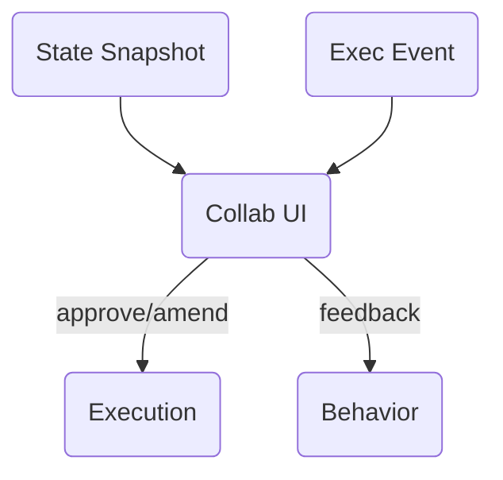

# Layer 5 – Collaboration / Human Interface

> **Mission ‑ Make cognitive agents safe, trusted, and usable by letting humans observe, intervene, and co‑create.**

Even the best automation must earn its autonomy. The Collaboration layer bakes human‑in‑the‑loop (HITL) and human‑on‑the‑loop (HOTL) patterns into the core architecture – **not** as an after‑the‑fact fallback.

---

## Why a dedicated Collaboration layer?

| Pain if ignored                                           | Benefit of an explicit layer                                    |
| --------------------------------------------------------- | --------------------------------------------------------------- |
|  Shadow approvals in Slack / email chains; no audit trail |  Deterministic interrupt‑approve‑resume hooks with provenance   |
|  Ops teams forced to trust a black‑box agent              |  Clear UX surfaces show context, planned actions, and rollbacks |
|  Regulatory or safety reviews become blockers             |  Built‑in checkpoints & diff views simplify certification       |

---

## Canonical Inputs & Outputs

| Item                                      | Format                             | Source / Destination         |
| ----------------------------------------- | ---------------------------------- | ---------------------------- |
| **In**  `StateSnapshot`, execution events | Pydantic / dataclass streams       | State & Execution layers     |
| **Out** `HumanAction`                     | approve · reject · amend · comment | Back to Execution / Behavior |

---

## Core Responsibilities

### 🛑 Interrupt / Approve / Resume

* Checkpoints in `ExecutionPlan` declare `requires_approval: true`.
* UI surfaces plan diff, risk score, and "Approve / Reject / Edit" buttons.
* Upon approval, Execution layer continues with preserved `StateSnapshot`.

### 🎚️ Role‑Aware UX Callbacks

* **Operators** → real‑time alerts, quick approve/reject.
* **Domain Experts** → rich diff view with inline edits.
* **Auditors** → read‑only log explorer + export.

### 📝 Audit & Compliance

* Every human action becomes a first‑class `HumanAction` record.
* Linked to plan ID, step ID, user ID, timestamp.
* Retained alongside Observability traces for post‑mortems.

---

## Principles Embodied

* **Human Collaboration by Design** – interruption and override are features, not failures.
* **Observable Everything** – human decisions are logged just like agent decisions.
* **Composable Error Handling** – rejection can route to Behavior layer for replanning or fallback.

---

## Production Checklist

* [ ] SLA for approval timeouts (auto‑fail or auto‑pass after X mins).
* [ ] RBAC enforcement on who can approve which tool classes.
* [ ] UX copy localization + accessibility audit.
* [ ] Webhook / message queues hardened for lost‑connection retries.
* [ ] Metrics: *approval‑to‑reject ratio*, *mean time to approve*, *manual‑override rate*.

---

> *“Autonomy is earned.  Collaboration is designed.”*
