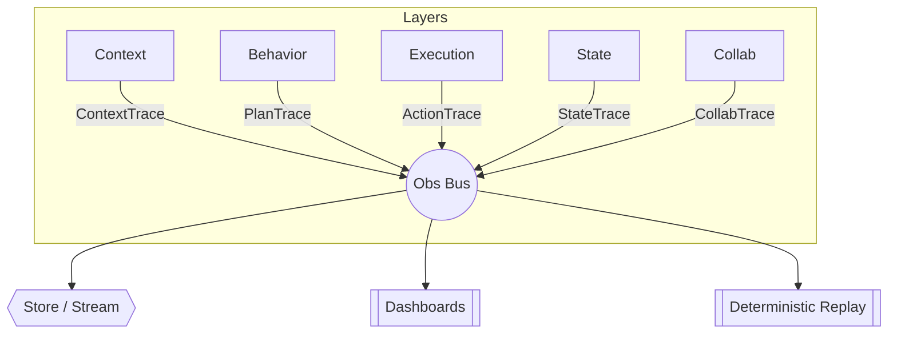

# Observability & Evaluation (Cross‑Cutting Bus)

> **Mission ‑ If you can’t trace it, you can’t trust it.**

The Observability bus is wired into every layer of CAA. It collects structured events, traces, and metrics so teams can debug, audit, and continually improve cognitive agents *in production*.

---

## Why a cross‑cutting layer?

| Pain when observability is bolted on   | Benefit of built‑in bus                             |
| -------------------------------------- | --------------------------------------------------- |
|  Silent failures & ghost retries       |  Instant root‑cause with step‑level traces          |
|  Dev vs prod drift – no parity         |  Same data shape for local replay & live ops        |
|  Impossible to quantify business value |  Task‑level success, MTTR, & human‑override metrics |

---

## What is captured?

| Event type       | Source layer  | Example fields                                         |
| ---------------- | ------------- | ------------------------------------------------------ |
| **ContextTrace** | Context       | raw input, schema id, enrichments                      |
| **PlanTrace**    | Behavior      | plan\_id, tool\_seq, planner\_model, latency           |
| **ActionTrace**  | Execution     | step\_id, tool, args\_hash, retries, duration, outcome |
| **StateTrace**   | State         | snapshot\_id, diff\_size, store\_latency               |
| **CollabTrace**  | Collaboration | hitl\_user, action, decision, timestamp                |

All traces share a **correlation‑id** so a single request forms a complete lineage graph.

---

## Replay & Introspection

* **Deterministic Replay API** – feed stored traces back into Context → … → State to reproduce behaviour exactly.
* **Step‑level diff viewer** – compare planned vs executed steps.
* **Prompt/Tool regression suite** – run historical traces against new code to catch drift.

---

## Evaluation Harnesses

* A/B or canary runs with shadow agents.
* Synthetic probes for edge‑case prompts.
* Business‑semantic KPIs (task success, approval latency, cost per workflow).

---

## Principles Embodied

* **Observable Everything** – every object in the stack emits telemetry.
* **Composable Error Handling** – failures propagate as typed events; monitoring hooks trigger escalate / retry policies.

---

## Production Checklist

* [ ] Unique correlation‑id per request.
* [ ] Trace sampling & redaction policies for PII.
* [ ] Dashboards for latency, success‑rate, human‑override‑rate.
* [ ] Replay harness in CI to catch regressions.

---

> *“Telemetry is the contract between AI and operations.”*
