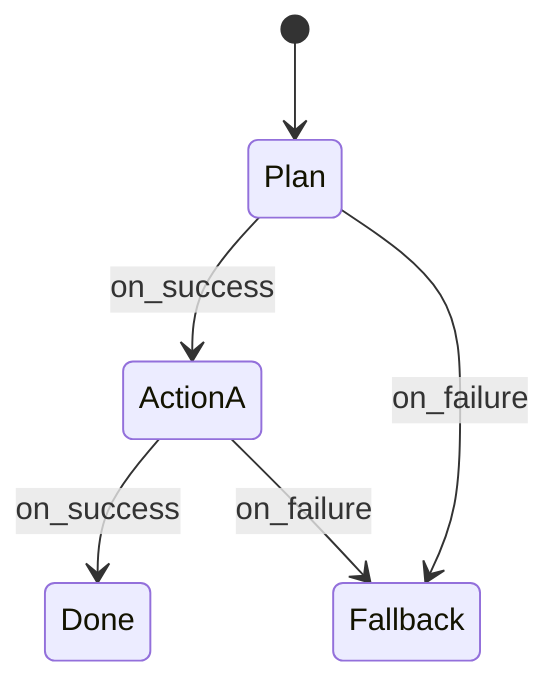

# Explicit Control Flow

> **Principle 3 – Make every step inspectable; no hidden loops.**

Agentic systems become un‑debuggable when the *how* is buried inside LLM prompts or recursive `while` loops.
CAA demands that the flow of execution is **declared, typed, and testable** – just like any other production workflow.

---

## Why It Matters

| Pain when flow is implicit                    | Benefit when flow is explicit         |
| --------------------------------------------- | ------------------------------------- |
| Infinite “think‑then‑act” loops               | Deterministic number of steps         |
| Can’t unit‑test a prompt with hidden branches | Logic can be covered by unit tests    |
| Hard to pinpoint failure root‑cause           | Each transition is logged & traceable |
| "Where did it decide that?"                   | Clear plan → step → result lineage    |

---

## Core Rules

1. **No Hidden Loops**
   ‑ LLMs do *not* call themselves recursively without an outer orchestration guard.
2. **Deterministic Steps**
   ‑ Each step is a function or tool call with typed I/O.
3. **Typed Transitions**
   ‑ Use an `ExecutionPlan` or state machine; transitions are data, not prose.
4. **No Implicit State Mutation**
   ‑ Memory/state changes are explicit events captured by the State layer.

---

## Implementation Patterns

* **State Machine** – e.g. XState, AWS Step Functions‑like JSON, or custom enum‐based reducer.
* **Directed Graph** – Nodes = steps, Edges = typed transitions (`on_success`, `on_failure`).
* **Declarative DSL** – YAML/JSON plan emitted by planner LLM, validated before execution.

---

## Production Checklist

* [ ] Flow specification stored in VCS and version‑tagged.
* [ ] Max‑step / timeout guards.
* [ ] Unit tests cover happy‑ and error‑paths.
* [ ] Trace IDs propagate through every transition.

---

> *"A prompt that decides its own next step is a speculation.
> A system that declares its next step is software."*
