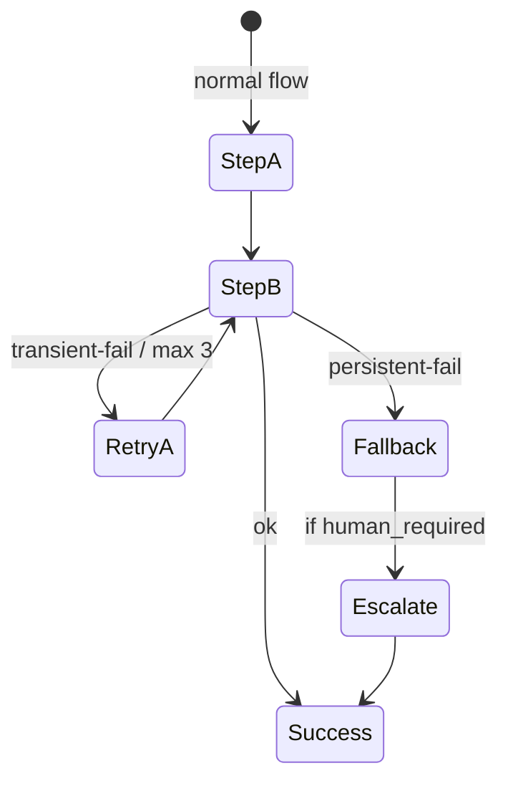

# Composable Error Handling

**Principle 9 of the Arti Agent Stack**

> Failures are inevitable.  Resilience is engineered.

Agentic systems operate in dynamic, unpredictable environments.  What
distinguishes a production‑grade system is **not the absence of errors, but how
predictably it recovers from them.**

---

## Why This Matters

LLMs will occasionally …

* misunderstand input
* misuse tools
* hit rate‑limits or timeouts
* stall on ambiguous tasks

If failure‑paths are an after‑thought, the system becomes brittle and unsafe.

---

## Design Contract

* **Retryable**  – transient errors trigger bounded, observable retries.
* **Fallback‑ready**  – alternate tools / simpler prompts are one hop away.
* **Escalatable**  – a human or supervisor agent can be pulled in at any step.
* **Typed errors**  – exceptions propagate as structured objects, not stray
  strings.

---

## Implementation Patterns

| Pattern              | Use‑case                                 |
| -------------------- | ---------------------------------------- |
| **Decorator Retry**  | Idempotent API/tool calls                |
| **Circuit Breaker**  | External services with unstable uptime   |
| **Fallback Chain**   | Multiple tools achieving the same intent |
| **Human Escalation** | Irreversible or high‑risk actions        |

> *Treat error handling like routing – composable, typed, and observable.*

---

## Anti‑Patterns

* Silent retries that mask systemic issues.
* Nested `try/except` blocks swallowing context.
* Letting the LLM decide its own error policy inside a prompt.

---

## Checklist

* [ ] All critical tools wrapped with retry + timeout decorators.
* [ ] Fallback path unit‑tested for primary tool failure.
* [ ] Escalation channel configured (Slack, email, etc.).
* [ ] Error objects logged with trace‑id for post‑mortem.

---

> "Design your agent stack like an operating system, not a toy demo."
